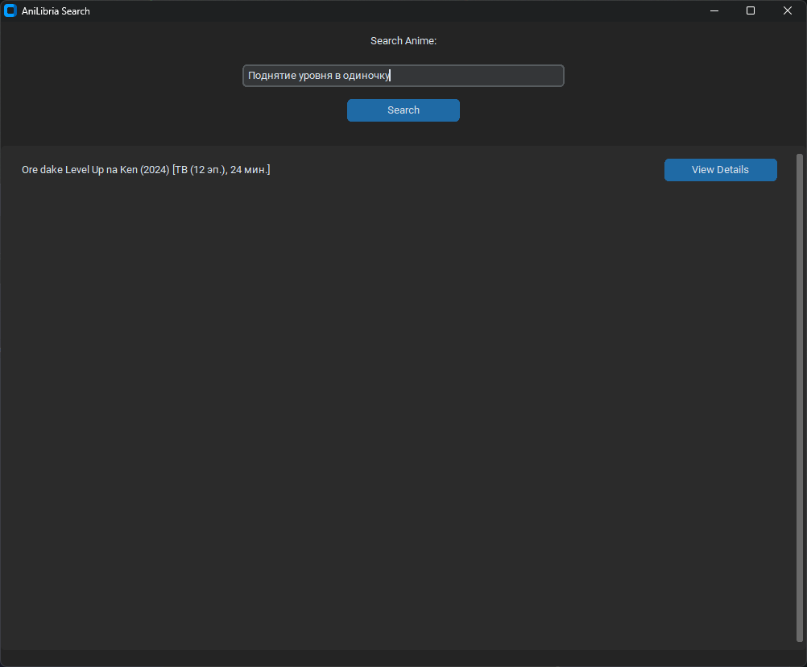
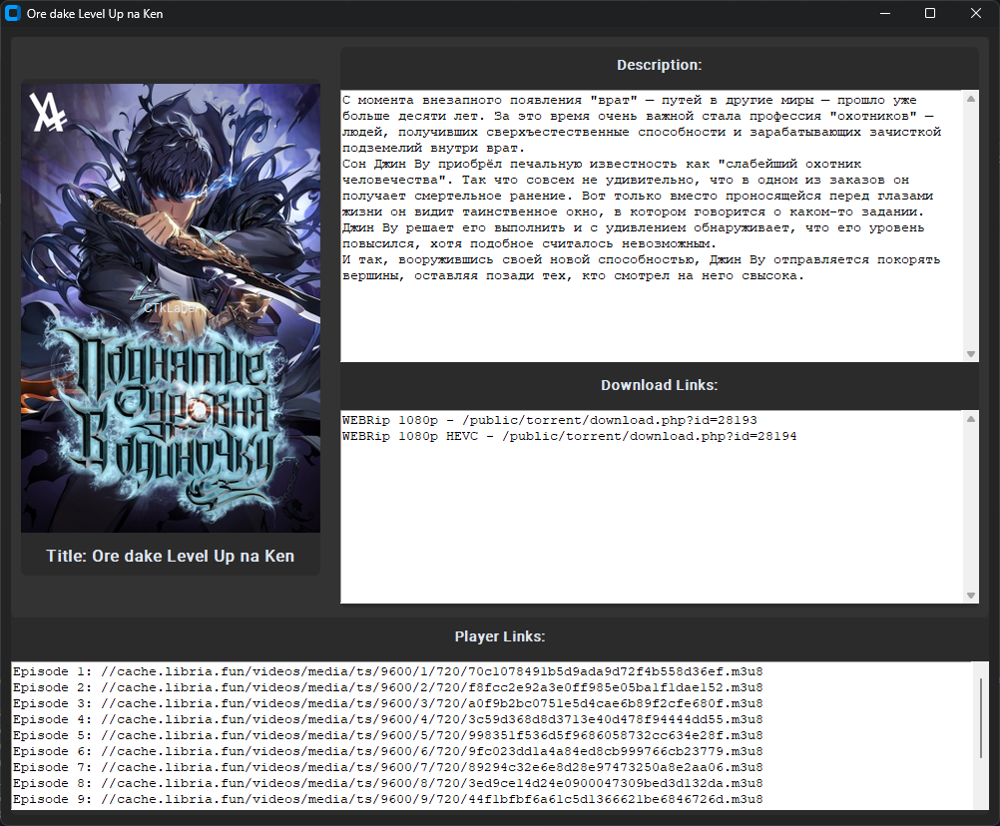

# AniLibria Search Application

AniLibria Search is a desktop application that allows users to search for anime using the AniLibria API. The application provides an easy-to-use interface for finding detailed information about various anime titles. 

**Note:** This application and its author are not affiliated with AniLibria.

## Features

- Search for anime by title.
- View detailed information about each anime.
- Display anime posters, descriptions, and download links.
- Player links for streaming episodes.

## Screenshots

### Main Search Interface


### Anime Details


## Installation

### Requirements

- Python 3.10+
- `customtkinter`
- `requests`
- `Pillow`

### Setup

1. Clone the repository:
    ```sh
    git clone https://github.com/ch1kulya/aniLibria-search-application.git
    cd aniLibria-search-application
    ```

2. Install the required packages:
    ```sh
    pip install -r requirements.txt
    ```

3. Run the application:
    ```sh
    python app.py
    ```

## Usage

1. Open the application.
2. Enter the title of the anime you want to search for in the search bar.
3. Click the "Search" button.
4. Browse the results and click "View Details" to see more information about the anime.

## Contributing

Contributions are welcome! Please fork the repository and submit a pull request with your changes.

## License

This project is licensed under the MIT License. See the [LICENSE](LICENSE) file for details.

## Disclaimer

This application and its author are not affiliated with AniLibria. The AniLibria API is used solely for providing anime information to users. All rights to the anime content belong to their respective owners.

## Contact

For any inquiries or issues, please open an issue on the GitHub repository or contact the author.
